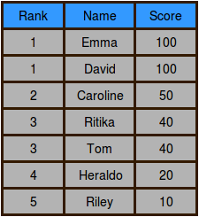

An arcade game player wants to climb to the top of the leaderboard and track their ranking. The game uses Dense Ranking, so its leaderboard works like this:

- The player with the highest score is ranked number **1** on the leaderboard.

- Players who have equal scores receive the same ranking number, and the next player(s) receive the immediately following ranking number.

**Example**

`ranked = [100, 90, 90, 80]`

`player = [70, 80 105]`

The ranked players will have ranks **1**, **2**, **2**, and **3**, respectively. If the player's scores are **70**, **80** and **105**, their rankings after each game are **4°**, **3°** and **1°**. Return **[4, 3, 1]**.

**Function Description**

Complete the climbingLeaderboard function in the editor below.

climbingLeaderboard has the following parameter(s):

- int ranked[n]: the leaderboard scores

- int player[m]: the player's scores

**Returns**

- int[m]: the player's rank after each new score

**Input Format**

The first line contains an integer **n**, the number of players on the leaderboard.

The next line contains **n** space-separated integers **ranked[i]**, the leaderboard scores in decreasing order.

The next line contains an integer, **m**, the number games the player plays.

The last line contains **m** space-separated integers **player[j]**, the game scores.

**Constraints**

- **1 <= n <= 2 * 10^5**
- **1 <= m <= 2 * 10^5**
- **0 <= ranked[i] <= 10^9** for **0 <= i < n**
- **0 <= player[j] <= 10^9** for **0 <= j < m**
- The existing leaderboard, **ranked**, is in descending order.
- The player's scores, **player**, are in ascending order.

**Subtask**

For **60%** of the maximum score:

- **1 <= n <= 200**
- **1 <= m <= 200**

**Sample Input 1**

```
7
100 100 50 40 40 20 10
4
5 25 50 120
```

**Sample Output 1**

```
6
4
2
1
```

**Explanation 1**

Alice starts playing with **7** players already on the leaderboard, which looks like this:



After Alice finishes game **0**, her score is **5** and her ranking is **6**:


After Alice finishes game **1**, her score is **25** and her ranking is **4**:


After Alice finishes game **2**, her score is **50** and her ranking is tied with Caroline at **2**:


After Alice finishes game **3**, her score is **120** and her ranking is **1**:


**Sample Input 2**

```
6
100 90 90 80 75 60
5
50 65 77 90 102
```

**Sample Output 2**

```
6
5
4
2
1
```
